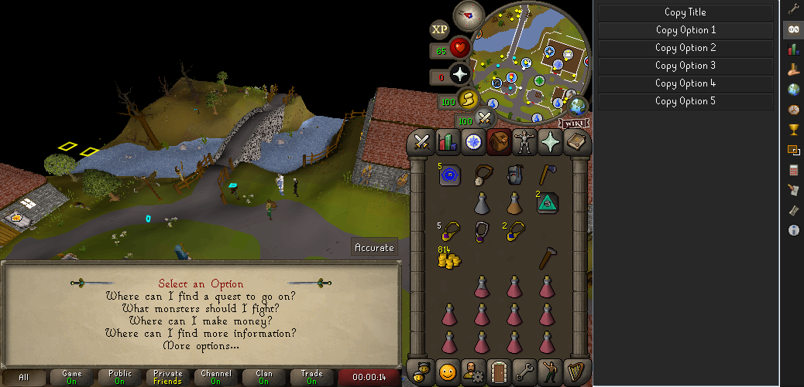

# Wiki Dialogue

Addon for runelite to extract text from NPC dialogues.

## Installation

### Software

GitHub Desktop & Github Account:
[https://desktop.github.com/](https://desktop.github.com/)
[https://github.com/join](https://github.com/join)

Intellij Idea (Community)
[https://www.jetbrains.com/idea/download/](https://www.jetbrains.com/idea/download/)

### Instructions

1. From [https://github.com/AshleyThew/wiki-dialogue](https://github.com/AshleyThew/wiki-dialogue) click the green 'Code' button.
2. Click 'Open with GitHub Desktop' and accept the popup if it appears.
3. Select a folder to clone the repository to ie (C:\Users\You\Documents\wiki-dialogue).
   
4. Start Intellij and open the folder you just downloaded. ie (C:\Users\You\Documents\wiki-dialogue).
5. Find the WikiDialoguePluginTest and right click the green start button.
6. Select Modify Run Configuration...
   
7. In the opened window press alt + v (or select modify options, and enable add VM options).
   
8. Add -ea into the VM option field.
9. Click Apply then Okay.
10. Start Runelite by now clicking the top right green Play button.
